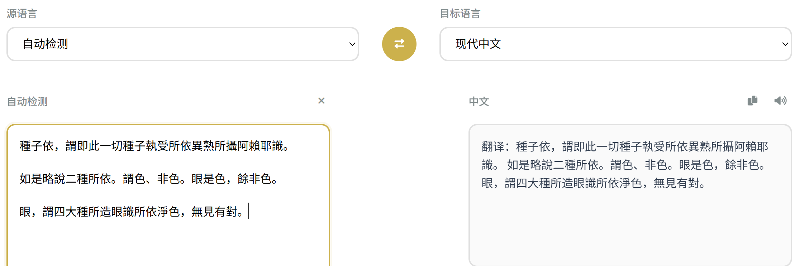

# 慧译通 - 佛教AI翻译器

[](https://github.com/xr843/Buddhist-AI-Translator)
[](https://github.com/xr843/Buddhist-AI-Translator)
[](https://github.com/xr843/Buddhist-AI-Translator/issues)
[](LICENSE)
[](https://xr843.github.io/Buddhist-AI-Translator)

> 🙏 **专业的佛教文献AI翻译平台** - 运用现代AI技术促进佛法学术研究与个人修行实践

[🌐 在线体验](https://xr843.github.io/Buddhist-AI-Translator) | [📖 使用指南](#🚀-快速开始) | [🤝 参与贡献](#🤝-开源协作) | [💬 问题反馈](https://github.com/xr843/Buddhist-AI-Translator/issues)

## 📸 项目展示



*慧译通主界面 - 简洁优雅的佛教AI翻译平台*

## 🎯 项目简介

慧译通是一款专为佛教文献翻译设计的AI翻译平台，结合了现代AI技术与深厚的佛学知识，为学者、修行者和佛学爱好者提供准确、专业的多语种翻译服务。

## ✨ 核心特性

### 🧠 AI智能翻译

- **深度学习模型**：基于DeepSeek AI API的专业翻译引擎
- **佛学语境理解**：内置50+佛教术语数据库，精准理解佛学概念
- **智能语言检测**：自动识别源语言类型，支持混合语言文本
- **长文本处理**：支持最大5000字符的长文本翻译
- **实时翻译**：快速响应，秒级完成翻译任务

### 🌐 多语言支持

- **中文**：现代中文、文言文/古汉语
- **英文**：标准英文翻译
- **梵文**：Devanagari字体、Harvard-Kyoto转写系统
- **藏文**：Unicode标准藏文
- **巴利文**：传统南传佛教语言
- **其他语言**：法文、德文、西班牙文、葡萄牙文、意大利文、荷兰文、日文、韩文、俄文、阿拉伯文
- **智能检测**：自动识别源语言类型

### 🎨 现代化界面

- **响应式设计**：完美支持移动端和桌面端
- **佛教主题**：金色配色方案，体现佛教庄严美感
- **直观操作**：语言选择和交换功能一目了然
- **实时反馈**：字符计数、翻译状态显示
- **优化布局**：紧凑设计，最大化内容显示区域

### 🛠️ 实用功能

- **语音输入**：支持语音转文字功能（需浏览器支持）
- **语音朗读**：AI语音播放翻译结果，支持多语言朗读
- **一键复制**：快速复制翻译内容到剪贴板
- **智能粘贴**：从剪贴板快速导入文本
- **语言互换**：一键交换源语言和目标语言
- **清空功能**：快速清除输入内容
- **键盘快捷键**：提升操作效率

## 🔧 技术实现

### 前端技术栈

- **HTML5**：语义化结构，提供良好的可访问性
- **CSS3**：响应式布局、Flexbox网格系统、动画效果
- **JavaScript ES6+**：模块化代码、异步处理、现代交互逻辑
- **Font Awesome 6.0**：丰富的图标库，增强用户体验
- **Google Fonts**：Noto Sans SC/Serif SC，优化中文显示效果

### AI翻译引擎

- **DeepSeek API**：集成先进的大语言模型
- **智能提示工程**：专门针对佛教文献优化的提示词
- **术语数据库**：内置佛教专业术语翻译对照
- **多层次翻译**：结合AI翻译和术语匹配双重保障

### 语音功能

- **Web Speech API**：原生浏览器语音识别和合成
- **多语言支持**：根据目标语言自动选择合适的语音引擎
- **文本分段**：智能分段朗读，提供更好的听觉体验
- **语音控制**：开始、暂停、停止语音播放

### 响应式设计特性

- **移动端优先**：Mobile-First设计理念
- **触摸友好**：优化的按钮大小和间距
- **自适应布局**：根据屏幕尺寸自动调整界面
- **流畅动画**：CSS3过渡效果，提升用户体验

## 📖 佛教术语数据库

内置超过50个常用佛教术语和概念：

### 经典文本

- **般若波罗蜜多心经**及相关术语
- **观自在菩萨**、**舍利子**等人物名称
- **色受想行识**等五蕴概念

### 基础概念

- **佛法僧三宝**
- **四谛八正道**
- **无常、无我、涅槃**等核心概念

### 宗派术语

- **唯识学派**：阿赖耶识、八识、三性等
- **中观学派**：中道、空性、缘起、二谛等
- **净土宗**：阿弥陀佛、极乐世界、念佛等
- **禅宗**：顿悟、明心见性等

## ⌨️ 键盘快捷键

- `Ctrl + Enter`：执行翻译
- `Ctrl + Shift + C`：复制翻译结果
- `Ctrl + Shift + V`：粘贴文本到输入框
- `Ctrl + Shift + X`：清空输入内容

## 🖥️ 浏览器兼容性

### 推荐浏览器

- **Chrome 90+** （推荐，功能支持最完整）
- **Firefox 85+**
- **Safari 14+**
- **Edge 90+**

### 功能支持

- **语音识别**：需要现代浏览器支持Web Speech API
- **语音合成**：需要现代浏览器支持Speech Synthesis API
- **剪贴板API**：需要HTTPS环境或本地环境
- **触摸手势**：移动端浏览器原生支持

## 🚀 快速开始

### 🔑 API密钥配置

在使用翻译功能之前，您需要配置DeepSeek API密钥：

1. **获取API密钥**

   - 访问 [DeepSeek开放平台](https://platform.deepseek.com)
   - 注册账号并登录
   - 在API密钥管理页面创建新的API密钥
2. **配置API密钥**

   - 打开翻译器页面
   - 点击右上角的设置按钮（⚙️图标）
   - 在弹出的对话框中输入您的API密钥
   - 点击"保存"按钮
3. **安全说明**

   - API密钥会安全地保存在您的浏览器本地存储中
   - 不会发送到任何第三方服务器
   - 清除浏览器数据会删除保存的密钥

### 在线使用

直接在浏览器中打开 `index.html` 文件即可开始使用，无需安装任何依赖。

### 本地部署

```bash
# 克隆项目
git clone https://github.com/[your-username]/buddhist-ai-translator.git

# 进入项目目录
cd buddhist-ai-translator

# 在浏览器中打开
open index.html
# 或者双击 index.html 文件
```

### 服务器部署

将所有文件上传到支持静态文件托管的服务器即可，推荐使用：

- **GitHub Pages**
- **Vercel**
- **Netlify**
- **Firebase Hosting**

## 📁 项目结构

```
buddhist-ai-translator/
├── index.html              # 主页面文件
├── styles.css              # 样式表文件
├── script.js               # JavaScript交互逻辑
├── README.md               # 项目说明文档
└── image/                  # 图片资源目录
    └── README/            # README文档图片
        ├── 1749601583838.png  # 主界面截图
        ├── 1749609635143.png  # 功能展示
        ├── 1749609650801.png  # 移动端界面
        └── 1749609669341.png  # 翻译结果展示
```

## 🔄 使用流程

1. **选择语言**：在源语言下拉菜单中选择输入语言，在目标语言菜单中选择翻译目标
2. **输入文本**：在左侧文本框中输入需要翻译的佛教文本（最大5000字符）
3. **执行翻译**：点击翻译按钮或使用 `Ctrl + Enter` 快捷键
4. **查看结果**：在右侧查看AI翻译结果
5. **使用工具**：可以复制结果、语音朗读或进行其他操作

## 🌟 项目亮点

- **专业性**：专门针对佛教文献翻译优化，理解佛学语境
- **准确性**：结合AI技术和佛学知识库，提供精准翻译
- **易用性**：直观的界面设计和丰富的交互功能
- **响应性**：完美适配各种设备和屏幕尺寸
- **开源性**：完全开源，欢迎社区贡献和改进

## 🤝 开源协作

我们欢迎各种形式的贡献：

- 🔤 **术语补充**：添加更多佛教术语和翻译对照
- 🔧 **功能改进**：优化用户界面和交互体验
- 🌐 **多语言支持**：增加更多语言对的支持
- 📝 **文档完善**：改进使用说明和技术文档
- 🐛 **问题反馈**：报告bugs和使用问题
- 🎨 **界面优化**：改进视觉设计和用户体验

## 📊 功能特性总览

| 功能模块   | 支持状态      | 说明             |
| ---------- | ------------- | ---------------- |
| AI翻译     | ✅ 完全支持   | DeepSeek API驱动 |
| 多语言     | ✅ 18种语言   | 包含主要佛教语言 |
| 语音输入   | ✅ 现代浏览器 | Web Speech API   |
| 语音朗读   | ✅ 多语言支持 | 智能语音选择     |
| 响应式设计 | ✅ 全设备适配 | Mobile-First     |
| 键盘快捷键 | ✅ 4个快捷键  | 提升操作效率     |
| 术语数据库 | ✅ 50+术语    | 持续更新中       |

## ⚠️ 免责声明

本翻译器提供的翻译结果仅供参考学习使用。对于重要的佛学文献研究或学术用途，建议：

- 咨询专业佛学学者
- 对照权威经典版本
- 参考多个翻译版本
- 注意文化和历史语境

## 📄 许可证

本项目采用开源许可证，欢迎在遵循许可证条款的前提下使用、修改和分发。

## 📞 联系我们

如有问题或建议，欢迎通过以下方式联系：

- 项目Issues：在GitHub仓库提交问题
- 邮件联系：[联系邮箱]
- 社区讨论：欢迎加入佛学AI翻译讨论群

---

© 2025 慧译通 - 佛教AI翻译器

*运用AI技术促进佛法学术研究与个人修行实践，通过开源协作推动佛学翻译的发展与普及。*

---

**愿以此功德，普及于一切。我等与众生，皆共成佛道。** 🙏
